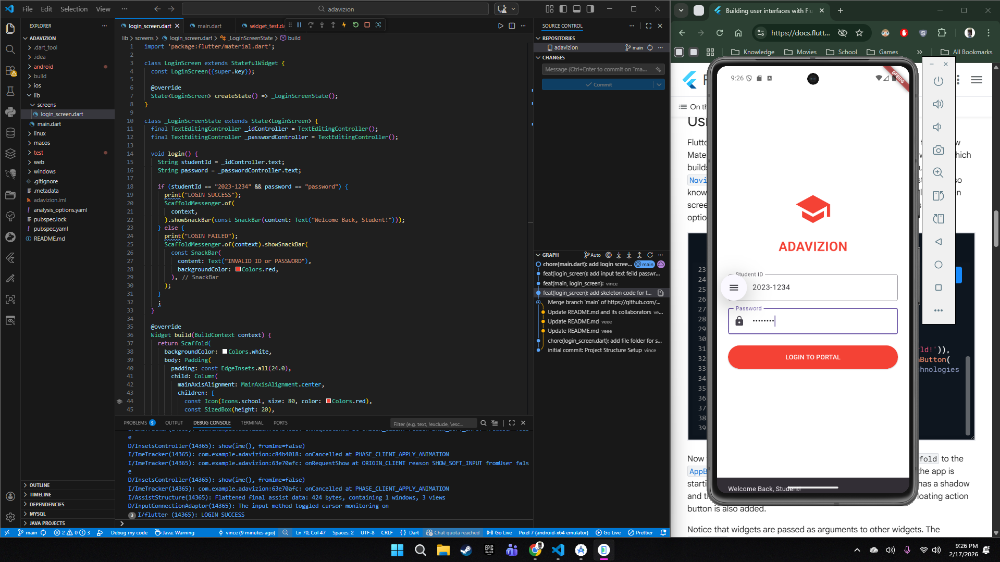

| Field | Details |
| :--- | :--- |
| **Date** | 2026-02-17 |
| **Project** | EUventure |
| **Topic** | Input Handling, Modularity, and Control Flow |
| **Developer** | Aguirre |
| **Tags** | `Flutter`, `Dart`, `Authentication`, `Clean Code`, `Dev Log` |

# 📝 DEV LOG: DAY 1

> **Objective:** Build a functional Login Screen for AdaVizion that accepts user input and validates credentials.
>
> **Outcome:** Implemented `TextEditingControllers` and `if/else` logic to create a secure entry point.

## ARCHITECTURE: MODULARITY
Instead of writing everything in `main.dart`, we split the code:
* **`lib/main.dart`**: The Entry Point (The "Launcher").
* **`lib/screens/login_screen.dart`**: The Feature (The "Page").

**Why?**
If we build a 50-page app, `main.dart` would be 10,000 lines long. By splitting it, we keep the code clean and manageable.

## THE LOGIC: CAPTURE & CHECK
### The Hook: `TextEditingController`
To get text *out* of a TextField, we need a controller.
```dart
final TextEditingController _idController = TextEditingController();
// usage: _idController.text
````

### The Brain: Control Flow
We used a simple condition to validate the user.

``` Dart
if (id == "2023-12345" && password == "maedara") {
  // Allow Entry
} else {
  // Show Error
}
```

### The Feedback: `SnackBar`
Instead of just printing to the console, we used `ScaffoldMessenger` to show a popup bar at the bottom of the screen.
- **Green/Default:** Success.
- **Red:** Error (Invalid Password).
  


## KEY WIDGETS USED
- **`TextField`**: The input box.
    
    - `obscureText: true`: Used for passwords (turns text into dots ••••).
    - `decoration`: Added icons (`Icons.lock`) and labels.
    
- **`ElevatedButton`**: The trigger for the login function.
- **`Padding`**: Added breathing room so the inputs didn't touch the screen edges.
