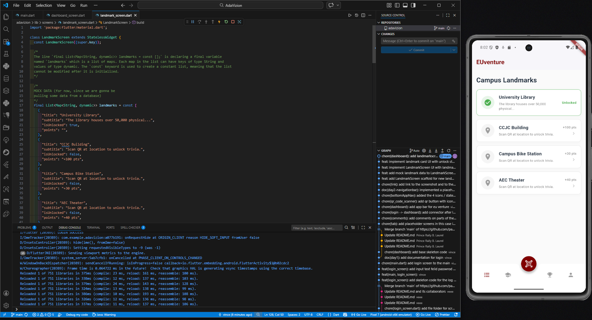

| Field | Details |
| :--- | :--- |
| **Date** | 2026-03-16 |
| **Project** | EUventure |
| **Topic** | Dynamic List Generation & Conditional State Styling |
| **Developer** | Aguirre |
| **Tags** | `Flutter`, `Dart`, `UI Architecture`, `Data Binding`, `Dev Log` |

# 📝 DEV LOG: WEEK 1 - DAY 3

**Core Objective:** Replace the static dashboard placeholders with a dynamic, scrollable list of campus landmarks featuring conditional visual states driven by mock backend data.

## 1. The Initiative & Context

To build the core gamified loop of the Euthenics exploration app, the frontend requires a scalable way to render campus locations. Hardcoding individual UI cards is highly inefficient and unmaintainable. The architectural requirement for Day 3 was to separate the data from the presentation layer—creating a mock dataset and injecting it into a dynamic list builder that automatically adapts its styling based on the user's progress (Unlocked vs. Locked states).

## 2. Component Architecture: Dynamic List Generation

### Implementation: `ListView.separated`

- **Issue:** Rendering dozens of complex UI cards simultaneously can cause memory bloat and frame drops on lower-end mobile devices.
- **Resolution:** Utilized Flutter's `ListView.separated` constructor instead of a standard `Column` or basic `ListView`.
- **Technical Execution:** This approach provides built-in, consistent spacing (`separatorBuilder: (context, index) => const SizedBox(height: 12)`) without needing to add margin to every individual card. More importantly, it lazy-loads the widgets, only rendering the cards currently visible within the viewport, ensuring 60fps scrolling performance regardless of how many landmarks are added to the campus.

## 3. UI Logic: Conditional State Styling

The UI required two distinct visual states for the same structural card component. Instead of building two separate widgets, conditional ternary operators (`condition ? true : false`) were utilized to drive the styling.

- **Data Binding:** A mock `List<Map<String, dynamic>>` was established to simulate a JSON payload from a future backend database.
- **State Extraction:** During the `itemBuilder` loop, the boolean state was extracted (`final bool isUnlocked = item["isUnlocked"];`).
- **Visual Transformations:**
  - **Borders & Backgrounds:** The `BoxDecoration` evaluates `isUnlocked` to swap the border and `CircleAvatar` backgrounds between a success green (`Colors.green.shade200`) and a disabled grey (`Colors.grey.shade200`).
  - **Iconography:** The leading icon dynamically swaps between `Icons.check_circle` and `Icons.location_on`.
  - **Trailing Data:** A UI logic gate (`if (!isUnlocked)`) was used to conditionally render the standard chevron arrow `>` only if the location has not yet been visited, while swapping the point value text to a bold "Unlocked" label.

## 4. The Output & Result

