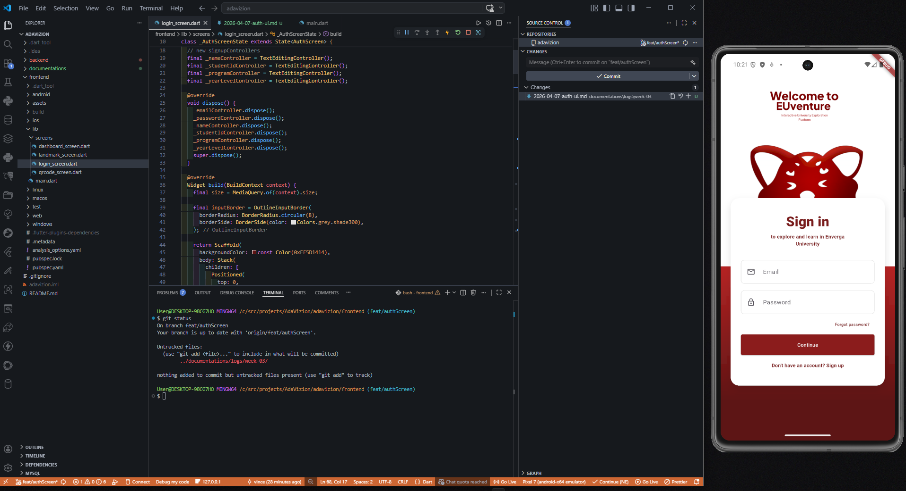
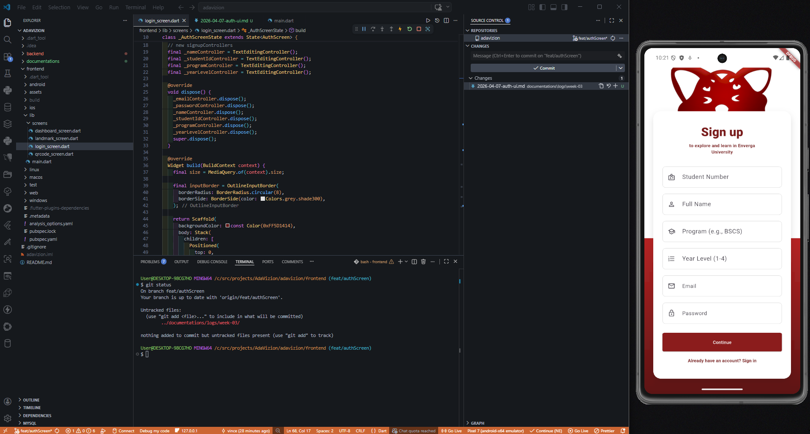
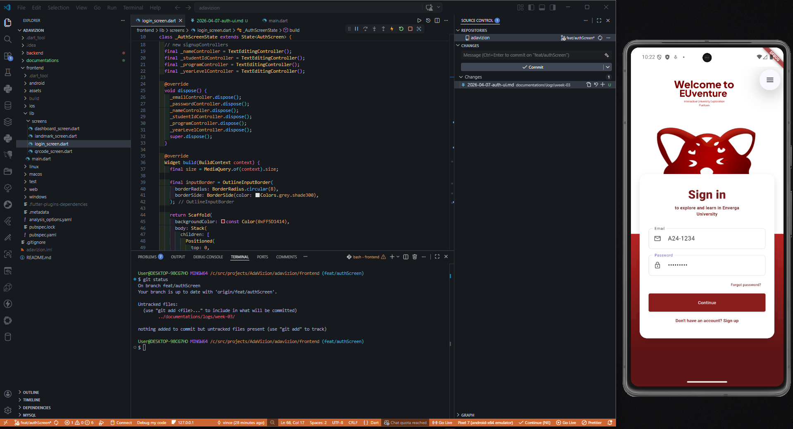

# 📝 DEV LOG: EUVENTURE - SIGN IN UI

**Core Objective:** Engineer a highly responsive, stateful unified authentication screen in Flutter that serves as a pixel-perfect replication of the high-fidelity Figma prototype, utilizing advanced Z-index layering, complex background gradients, and dynamic form rendering.

## 1. The Initiative & Context
For the EUventure platform, user experience begins at the authentication layer. Legacy applications often separate login and registration into disjointed screens, causing unnecessary navigation friction. Today's initiative focused on building a modern, unified architectural approach: a single stateful screen that elegantly toggles between authentication modes. Beyond the logical structure, the primary challenge was executing a flawless UI implementation that respected the exact specifications of the design team's Figma prototype, specifically a massive, overlapping mascot and a deep, two-tone background layout.

## 2. Architectural Decisions & UI Engineering
Translating a static design into a fluid, responsive mobile interface required specific structural strategies within the Flutter widget tree.
### Concept A: The Split-Screen Gradient Architecture
The Figma design did not rely on a standard solid background color; it demanded a crisp division where the top hemisphere remained stark white to highlight the branding, while the bottom hemisphere featured a rich, shadowed gradient.

*   **Implementation:** A root `Stack` widget was employed as the canvas. A `Positioned` container was explicitly anchored to the bottom percentage of the screen (`size.height * 0.55`).

*   **The Gradient Map:** A `LinearGradient` was applied with a `begin: Alignment.topCenter` and `end: Alignment.bottomCenter`, transitioning from a lighter red at the intersection to a deep, dark red (`#5D1414`) at the device's base.

*   **System Bar Resolution:** A critical Android rendering issue emerged where the transparent system navigation bar exposed a stark white box at the bottom of the screen. This was systematically resolved by binding the root `Scaffold`'s `backgroundColor` to the darkest hex code of the gradient, ensuring the system UI blended invisibly into the application's theme boundary.

### Concept B: Z-Index Layering & The Mascot Override
The most iconic element of the prototype was the application mascot overlapping the white authentication card. 

*   **The Stack Order Protocol:** In Flutter, the rendering engine paints widgets in the exact order they are declared in a `Stack`. To achieve the "peeking" visual effect, the mascot `Image.asset` was declared *first* (establishing the background layer), while the primary form `Container` was declared *second* (establishing the foreground layer).

*   **Precise Offsets:** Using `margin: EdgeInsets.only(top: 170)`, the white card was pushed exactly far enough down the Y-axis to cover the lower half of the mascot, seamlessly creating the illusion of physical depth and overlap.

## 3. Dynamic Form Rendering & State Management
The UI must react instantly to user intent without initiating a costly screen route transition.

**The Stateful Toggle Flow:**
1.  **State Initialization:** The screen is wrapped in a `StatefulWidget` with a private boolean flag, `_isLoginMode`, initialized to `true`.

2.  **The Spread Operator (`...`):** Within the layout `Column`, Flutter's collection if-statement (`if (!_isLoginMode) ...[ ]`) is utilized. This dynamically injects or removes multiple widget nodes from the tree based on the current state.

3.  **Registration Fields:** When toggled to Sign-up mode, the tree instantly expands to mount dedicated `TextField` widgets for `Student Number`, `Full Name`, `Program`, and `Year Level`, alongside the persistent `Email` and `Password` inputs.

4.  **Memory Management:** Each input field is strictly bound to its own `TextEditingController`. To prevent memory leaks during the application lifecycle, all controllers are systematically explicitly disposed of in the `dispose()` override method.

## 4. The Transformation Scaling Solution
A significant layout constraint was encountered when attempting to match the massive scale of the mascot from the design file. Increasing the physical `height` or `width` of the image asset caused the invisible layout bounding box to expand, which forcefully pushed the white form card down and broke the screen's responsiveness.

**The Fix: `Transform.scale`**

*   Rather than altering the layout constraints, a `Transform.scale` widget was wrapped around the image. 
*   By setting a high scale factor (e.g., `scale: 2.2`), the rendering engine visually multiplied the size of the pixels by 220% *without* communicating that size change to the parent layout constraints.
*   By enforcing `alignment: Alignment.bottomCenter`, the transformation anchor was locked directly at the mascot's chin. As the image scaled up, it expanded *outwards* to the screen edges and *upwards* toward the branding text, achieving absolute visual parity with the Figma prototype without disrupting the heavily calculated spacing of the authentication card.

## 5. Output
The authentication frontend now operates as a complete, responsive, and visually identical representation of the design specifications.

*   **Viewport Integrity:** Implementing `SafeArea` and `SingleChildScrollView` ensures that when the device keyboard deploys, the dynamic form scrolls smoothly without throwing out-of-bounds pixel overflow errors.

*   **Upcoming Integration:** With the UI layer finalized and all text controllers successfully capturing user input, the architecture is fully primed for the next phase: binding these controllers to the asynchronous HTTP logic to interface with the backend JSON Web Token authentication endpoints.

