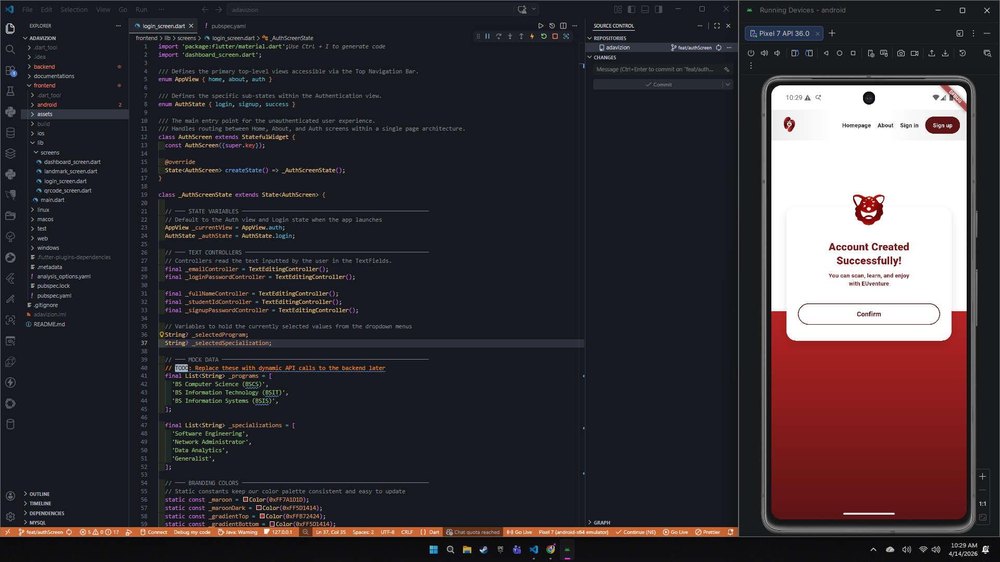
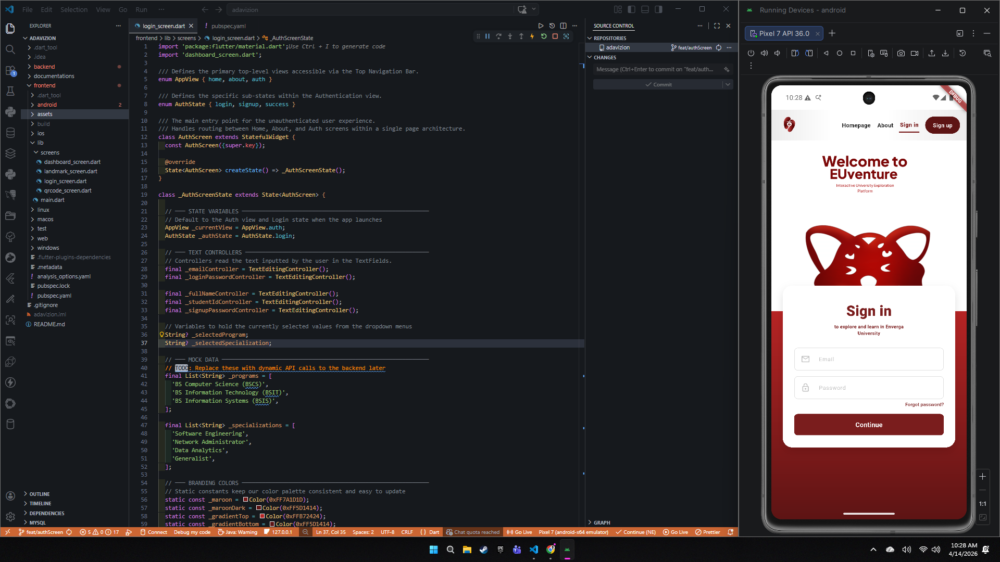
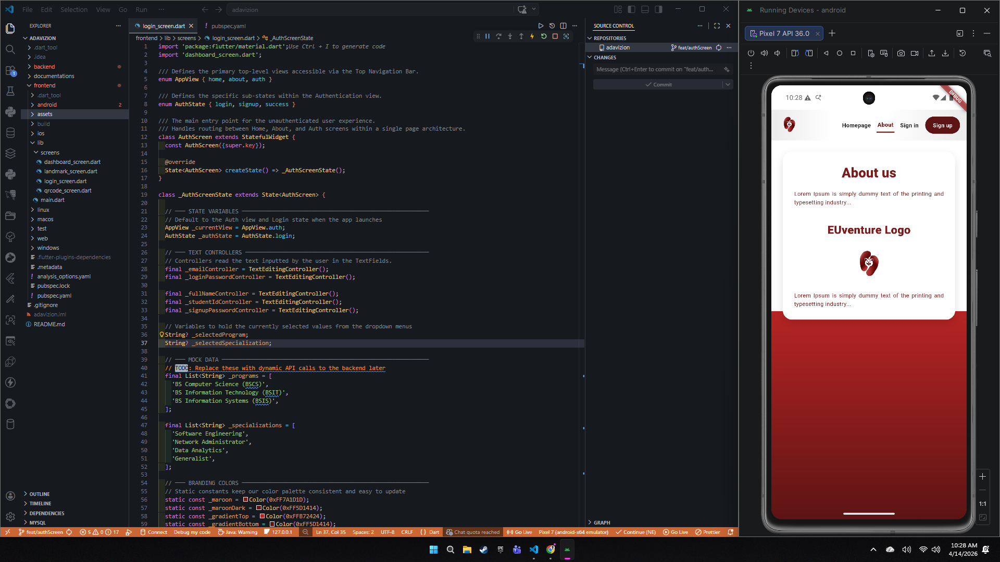
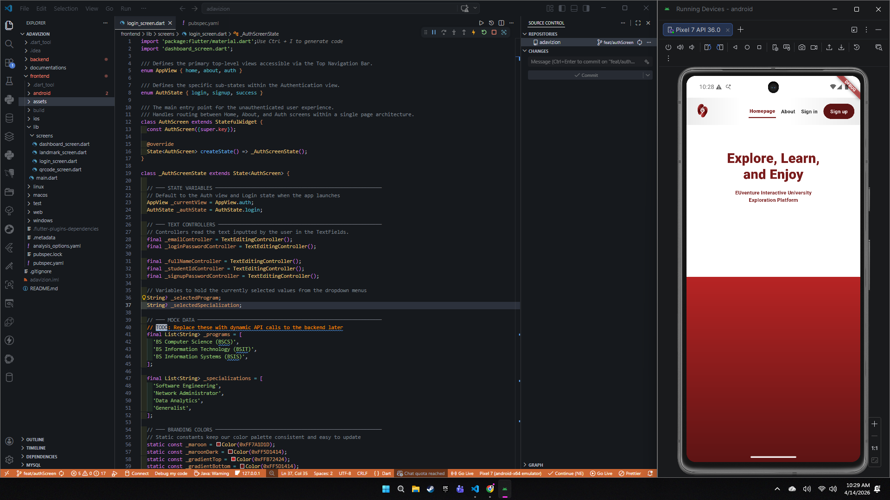
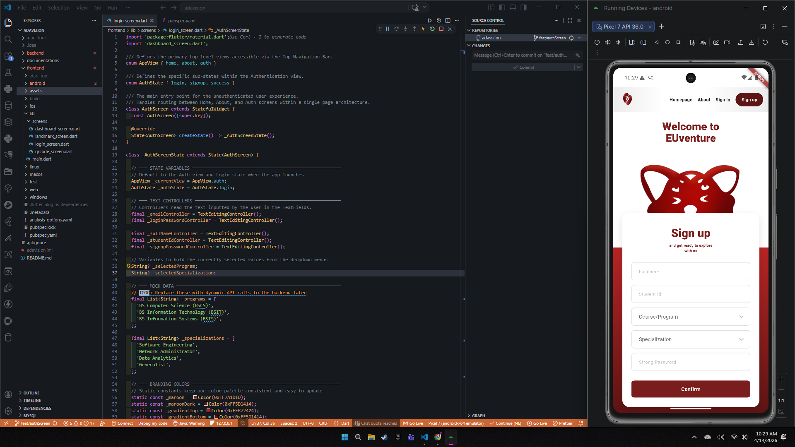
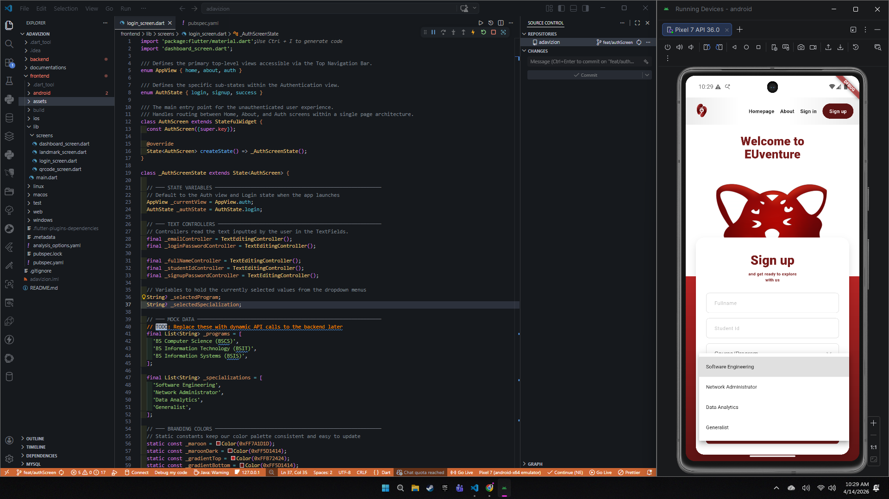

# 📝 DEV LOG: EUVENTURE - UNIFIED AUTHENTICATION & NAVIGATION FRONTEND

**Core Objective:** Finalize the highly responsive, stateful unified authentication screen and implement a top-level navigation architecture that perfectly replicates the high-fidelity Figma prototype. This includes advanced Z-index layering, custom gradient backgrounds, and dynamic dropdown menus.

## 1. Architectural Upgrade: `AppView` & State Routing
To accommodate the new Figma designs, the application's entry layer was upgraded from a simple authentication toggle to a comprehensive state router.
* **Implementation:** Introduced the `AppView` enum (`home`, `about`, `auth`) and nested the `AuthState` enum (`login`, `signup`, `success`) within it.
* **The Switchboard Logic:** A `_buildCurrentView()` method now acts as a dynamic router, swapping out the main screen body without triggering costly page loads (`Navigator.push`), creating a seamless, Single-Page Application (SPA) feel.

## 2. Top Navigation & Brand Integration
The legacy floating "Return to Sign In" button was deprecated in favor of a persistent, web-style top navigation bar.
* **Gradient Precision:** Engineered a custom `LinearGradient` across the navigation bar (`#EBEBEB` to `Colors.white` and back) using explicit color stops `[0.0, 0.31, 0.59, 1.0]` to match the design spec exactly.
* **Asset Synchronization:** Integrated the new bean-shaped EUventure brand mark (`nav_logo.png`) as the primary top-left branding element.
* **Dynamic Active States:** Programmed the `_navTextItem` widget to dynamically apply a 2px maroon `BorderBottom` and increase font weight when its target view matches the current state.

## 3. The Mascot Layout 
The most technically demanding aspect of the UI was achieving the massive, screen-spanning mascot overlap without breaking Flutter's `SingleChildScrollView` boundaries.
* **The Layout Conflict:** Standard `Positioned` widgets caused the scroll view to collapse the image height to zero, while `Transform.scale` caused unpredictable clipping.
* **The Final Solution:** Orchestrated a precise `Stack` layout.
  * **Foreground:** The white form card was assigned `margin: EdgeInsets.only(top: 150)` to push it down the Y-axis.
  * **Background:** The mascot was locked in using `Positioned(top: -112, left: 5, right: 5)`. 
  * **Scaling:** By applying `BoxFit.fitWidth`, the rendering engine was forced to calculate the image's height proportionally based on the screen width, allowing it to stretch massively and tuck its chin perfectly behind the foreground card.

## 4. UI Polish & Form Enhancements
* **Structured Inputs:** Upgraded the standard `TextField` widgets for "Course/Program" and "Specialization" to `DropdownButtonFormField` widgets. This prevents user typos and guarantees clean data for the backend database. 
* **Aesthetics:** Styled the dropdowns with a pure white `dropdownColor` and custom chevron icons. Replaced boxy buttons with sleek, pill-shaped `ElevatedButton` shapes (`borderRadius: BorderRadius.circular(30)` or `8` depending on context).
* **Centering:** Wrapped the dynamic header titles in `Center` widgets and adjusted `SizedBox` paddings to ensure horizontal and vertical balance across all devices.

## 5. Codebase Maintainability & Documentation
Before concluding the session, the entire `login_screen.dart` file was heavily documented.
* Applied standard `///` documentation comments to classes and methods for IDE hover-support.
* Added inline `//` comments explaining the specific mathematical offsets and Z-index logic behind the overlapping layouts to ensure future maintainability by the development team.

## 🎯 Next Phase 
With the frontend UI layer 90% complete and visually validated against Figma, the architecture is fully primed for backend integration. The next step is to bind the `TextEditingControllers` to the asynchronous `fetch` logic to interface with the backend and manage the JSON Web Tokens (JWTs).

