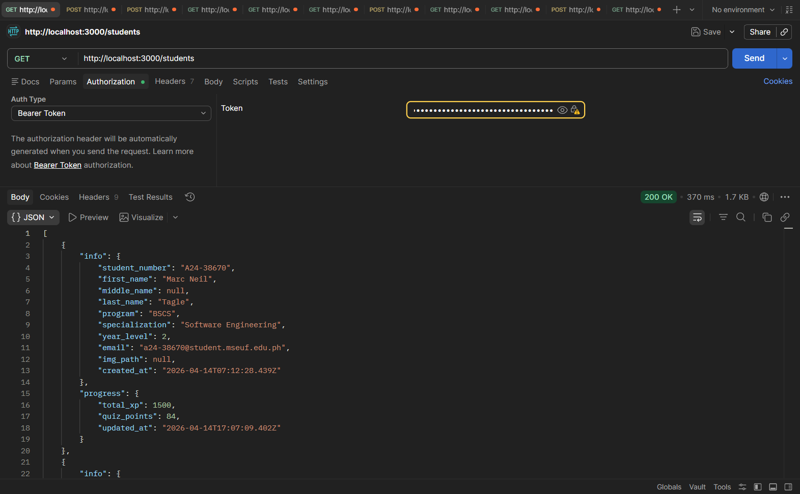
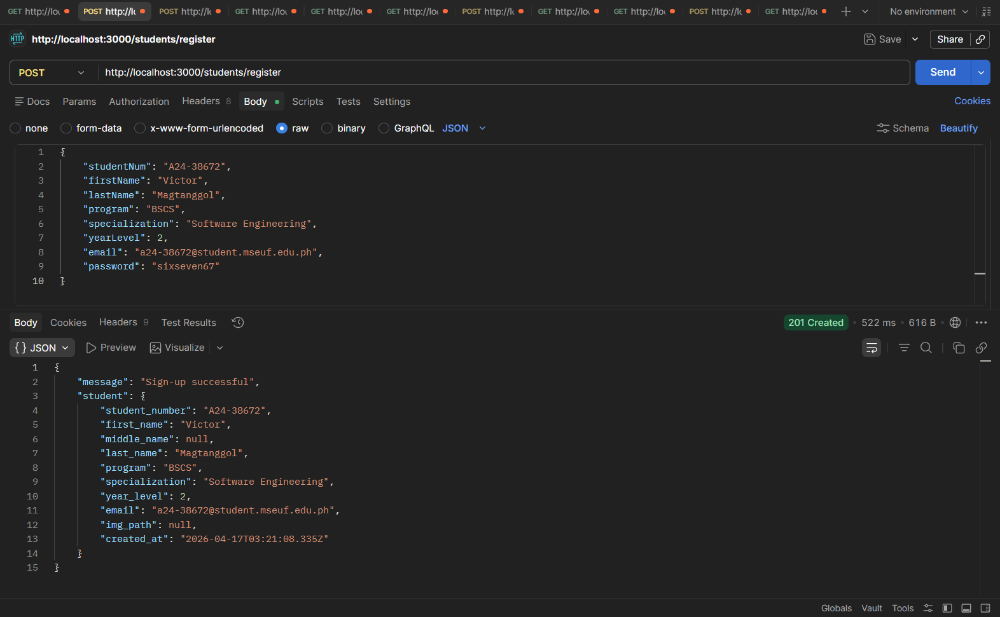
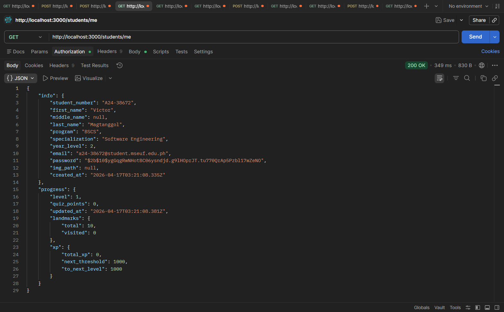
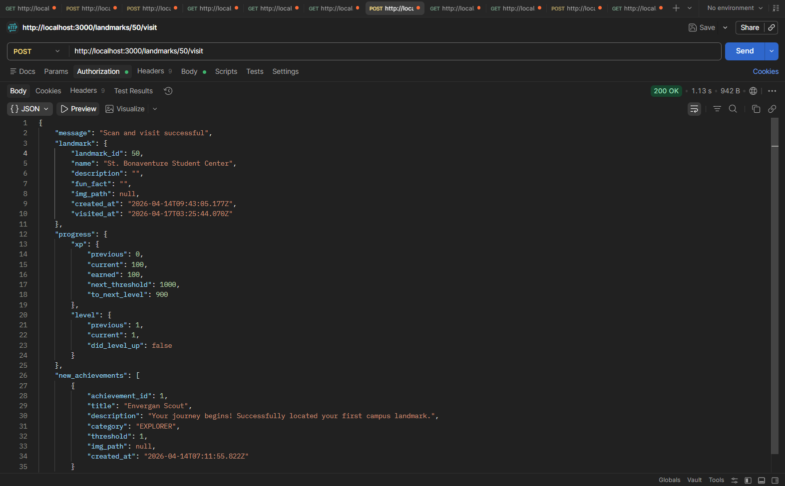
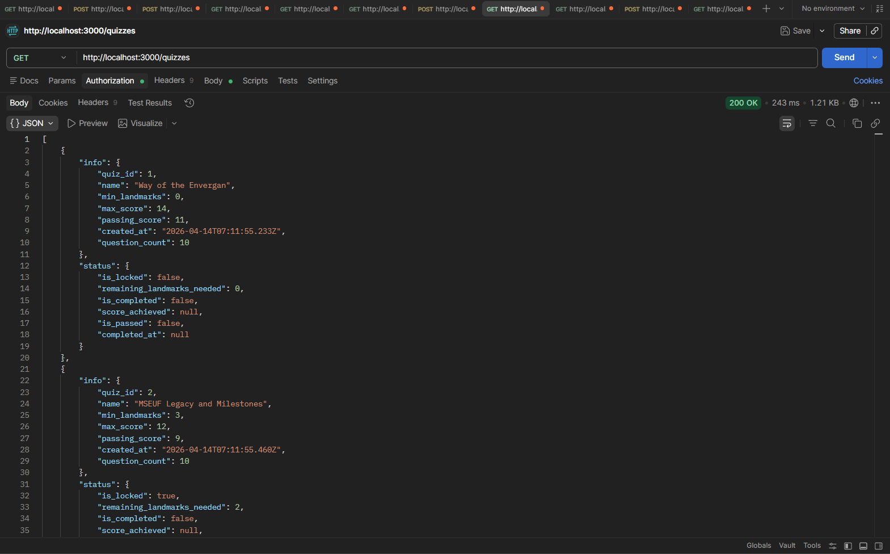
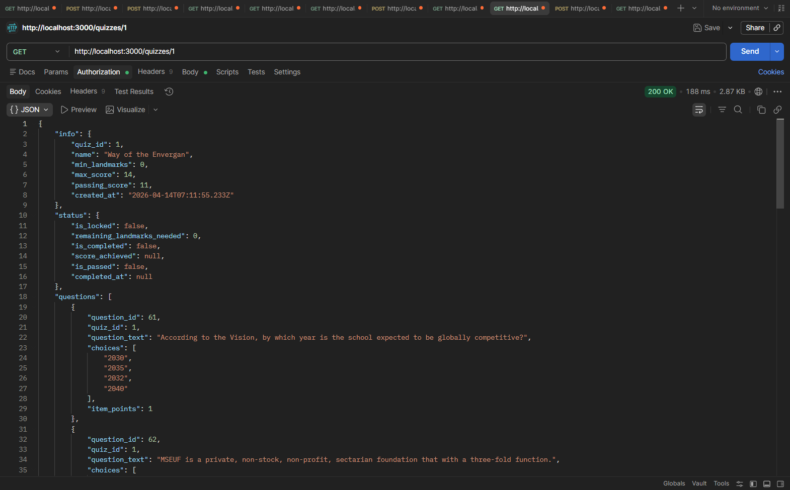
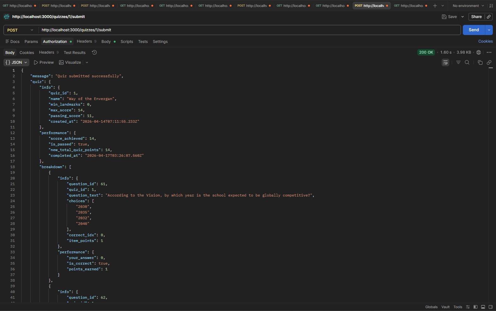

| Field | Details |
| :--- | :--- |
| **Date** | 2026-04-18 |
| **Project** | EUventure |
| **Topic** | Gamification Logic & RCSR Achievements Refactor |
| **Developer** | Tagle |
| **Tags** | `Gamification`, `XP`, `Zod`, `Refactoring`, `RCSR`, `Prisma`, `CORS` |

# DEV LOG: WEEK 4 - DAY 2

## Core Objective

Overhaul the core gamification loop to prioritize physical exploration over passive XP accumulation and finalize the Achievements module's transition to a modular RCSR architecture.

## 1. Gamification & Unlock Logic

The progression system was reimagined to better align with the project's goal of campus exploration.

   * **Landmark-Based Unlocking:** Shifted the gating mechanism for quizzes. Students can no longer unlock academic assessments via total XP; they must now physically visit a specific number of landmarks (`min_landmarks`).

   * **XP Rewards Balancing:** Standardized reward values across the system. Landmark visits now grant 100 XP, while passing a quiz grants 200 XP, with a level-up threshold set at 500 XP.

   * **Centralized Config:** Moved all gamification constants to `src/constants/gamification-config.ts` to allow for rapid tuning during the pilot testing phase.

## 2. Zod Validation Refactor

Refactored the validation layer to reduce technical debt and ensure consistency between authentication and registration.

   * **Modular Zod Schemas:** Decomposed `RegistrationSchema` and `LoginSchema` into shared "base" building blocks.

   * **DRY Implementation:** By assembling schemas from shared primitives, we ensured that changes to field constraints (like student number length) automatically propagate across all related endpoints without breaking individual `.refine()` logic.

## 3. RCSR Architecture & Service Optimization

Continued the backend cleanup by migrating the Achievements module to the standardized Route-Controller-Service-Repository (RCSR) pattern.

   * **Achievements Decoupling:** Achievements logic is now fully isolated into dedicated repository and controller files, removing bloat from the student domain.

   * **Payload Optimization:** Excluded `achievements_earned` from general student queries. This reduces the response size for frequent profile fetches, moving achievement data to its own specialized `/achievements` endpoint.

   * **Infrastructure:** Configured `CORS` middleware to enable seamless connectivity between the mobile frontend and the development server.

## Updated API Responses

| Endpoint | Layers Added/Modified | Changes in Response Body | Screenshot |
| --- | --- | --- | --- |
| `/students` | `fetchStudents` | Basic student details in `info` and progress in `progress`. |  |
| `/students/register` | `processStudentRegistration` | Added missing success message. |  |
| `/students/me` | `fetchStudentProfile` | Basic student details in `info` and progress in `progress`, with landmarks and xp having sub-objects. |  |
| `/landmarks/:id/visit` | `processLandmarkVisit` | Basic landmark details in `landmark`, and updated xp and level status in `progress.xp` and `progress.level` respectively. |  |
| `/quizzes`, `/quizzes/:id` | `fetchQuizzes`, `fetchQuiz` | Basic quiz details in `info` and quiz status in `status`. |   |
| `/quizzes/:id/submit` | `processQuizSubmission`, `evaluateQuestionResponses` | Basic quiz details in `quiz.info`, actual test results in `quiz.performance`, and the question-by-question review in `quiz.breakdown`, updated xp and level status in `progress.xp` and `progress.level` respectively. Individual question reviews are further organized into `breakdown.info` for question details and `breakdown.performance` for question performance.  |  |