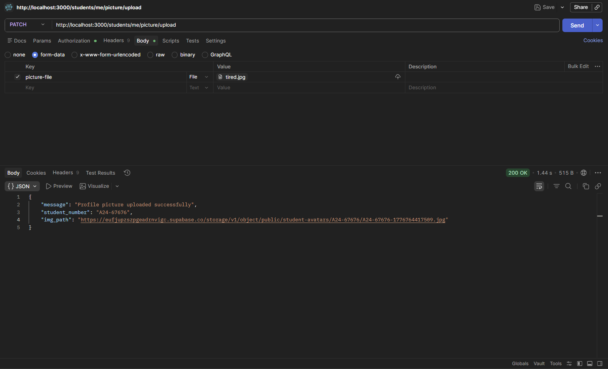
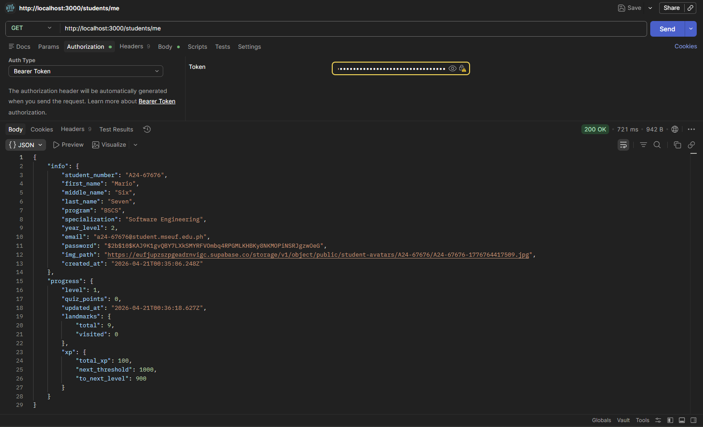

| Field | Details |
| :--- | :--- |
| **Date** | 2026-04-21 |
| **Project** | EUventure |
| **Topic** | Student Profile Picture Upload Integration |
| **Developer** | Tagle |
| **Tags** | `Supabase`, `Multer`, `Prisma`, `Cloud Storage`, `Express`, `Refactoring` |

# DEV LOG: WEEK 4 - DAY 4

## Core Objective

Implement a robust profile picture upload system for the EUventure backend, integrating multipart form-data parsing with cloud-based object storage (Supabase) and relational database synchronization (PostgreSQL).

## 1. Cloud Storage Infrastructure

Configured the persistence layer to handle binary large objects (BLOBs) efficiently while maintaining security.

   * **Supabase Integration:** Introduced `supabase.ts` client utility to interface with the backend.
   * **Bucket Orchestration:** Provisioned and configured the `student-avatars` bucket for media persistence.
   * **Resource Partitioning:** Implemented a directory-based storage strategy using `${studentNum}/${studentNum}-${Date.now()}` to prevent file collisions and bypass client-side caching.

## 2. Multipart Form Handling & Validation

Standardized how the server ingests and validates file streams to ensure system stability and security.

   * **Multer Middleware:** Integrated Multer using memory storage for high-speed processing before cloud offloading.
   * **Payload Constraints:** Enforced a 50MB file size limit (thanks to Supabase free tier) and image-only MIME type filtering to comply with infrastructure constraints and optimize mobile rendering.
   * **Route Implementation:** Exposed the `PATCH /students/me/picture/upload` endpoint, utilizing the `/me` alias for secure, session-based resource targeting.

## 3. Repository Pattern & Dual-Write Operations

Expanded the data access layer to synchronize state across decoupled storage systems.

   * **`updateStudentAvatar`:** Developed a repository function to handle the dual-write handshake: uploading the buffer to Supabase Storage and updating the `img_path` in PostgreSQL via Prisma.
   * **Prisma Updates:** Utilized `update` logic to ensure the student record maintains a single, valid reference to their latest avatar URI.

## 4. Enhanced Error Mapping & Resiliency

Refined the central error handling logic to provide descriptive, actionable feedback for file-based exceptions.

   * **Middleware Interception:** Expanded `handleControllerError` to catch and translate `MulterError` instances (e.g., `LIMIT_FILE_SIZE`, `LIMIT_UNEXPECTED_FILE`).
   * **Standardized Responses:** Added specific student profile error details to `error-maps.ts` to ensure consistent API behavior between the backend and the Flutter mobile client.

## 5. Developer Experience & Chore

Refined the development environment to support the new cloud-dependent workflows.

   * **Environment Configuration:** Updated `.env.example` with necessary Supabase credentials (URL and Service Role Key).
   * **CORS Policy:** Updated server configuration to support `PATCH` methods, enabling cross-origin profile modifications from the mobile frontend.

## Tested Endpoints

| Endpoint | Method | Description | Screenshot |
| --- | --- | --- | --- |
| `/students/me/picture/upload` | `PATCH` | Response body includes `student_number` and `img_path`. |  |
| `/students/me` | `GET` | `img_path` now shows the URL of the uploaded profile picture in Supabase to show on the frontend. |  |