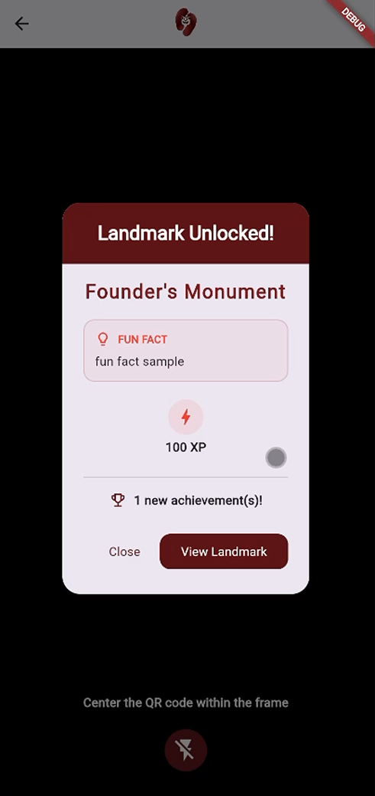
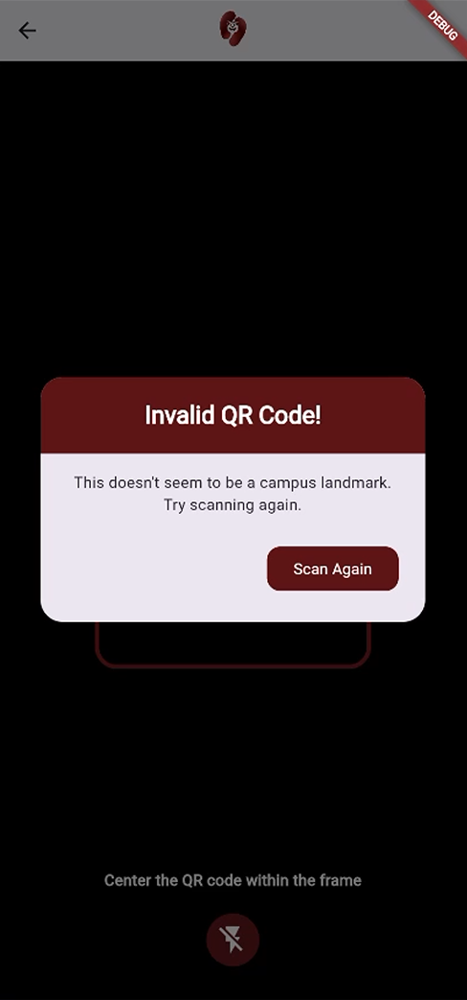
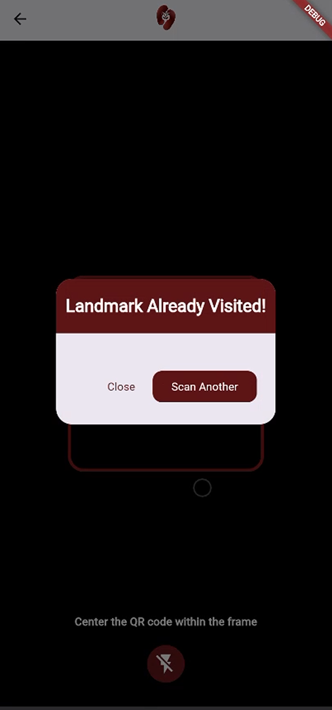
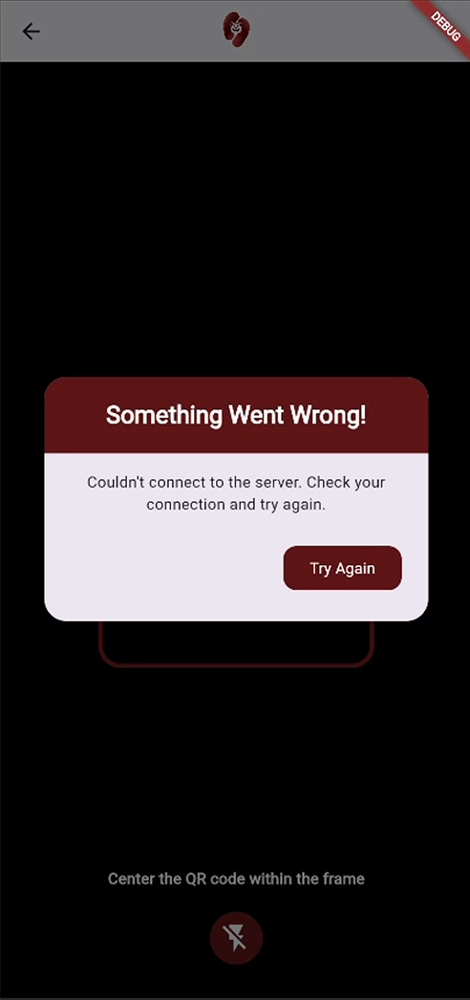
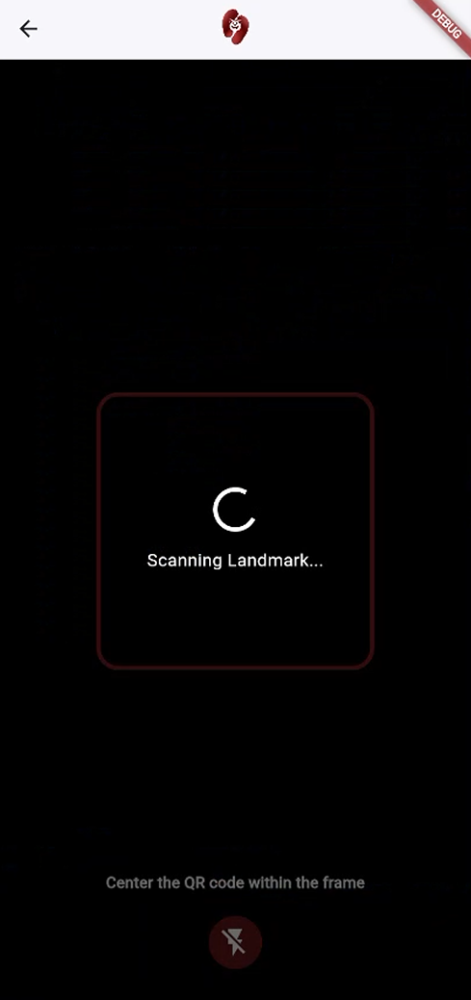

| Field | Details |
| :--- | :--- |
| **Date** | 2026-04-21 |
| **Project** | EUventure |
| **Topic** | QR Code Scanner — Landmark Backend Integration & UI Revamp |
| **Developer** | Dequito |
| **Tags** | `Flutter`, `Frontend`, `mobile_scanner`, `State Management`, `UI Design`, `Dev Log` |

# DEV LOG: WEEK 4 - DAY 4

## Core Objective

Complete the QR scanner screen by connecting it to the landmark backend, implementing a proper scan --> visit flow, redesigning all modals to match the EUventure brand.

---

## 1. Backend Integration
Wired `QRCodeScreen` to the existing `LandmarkApi` service layer.

   * **`LandmarkApi.getChecklist()`:** Called on every successful scan to retrieve the full list of campus landmarks with their IDs, used to match the scanned QR strings against the correct landmark record on the server-side.
   * **`LandmarkApi.visitLandmark(id, qrCode)`:** The backend validates the `qr_code_scanned` field against its stored `qr_string` and returns full reward data on success.
   * **UUID QR format handling:** QR codes were finalized as UUIDs, not integer IDs. Since `getChecklist()` intentionally omits `qr_string` for security, a sequential-try approach is used — iterating the checklist and submitting against each landmark until one accepts or all reject. A dedicated `/landmarks/scan` endpoint has been flagged as a future backend task to replace this.
   * **Response unpacking:** On a successful visit, the response payload's `landmark`, `progress`, and `new_achievements` fields are all read and surfaced in the success modal.

---

## 2. Scan Handling & State Management

Refactored `_handleScan` into a clean async flow with proper state transitions.

- **`_isScanning` flag:** Guards `onDetect` to prevent duplicate triggers while a scan is already being processed. Reset via `_resetScanner()` when any dialog is dismissed.
- **`_isLoading` flag:** Drives a full-screen loading overlay shown while API calls are in-flight. Wrapped in a `finally` block so it always clears regardless of success, error, or exception.
- **`_resetScanner()`:** Centralized helper that calls `_cameraController.start()` and resets `_isScanning = true`. Called from every dialog dismissal path so the scanner is always left in a resumable state.
- **`if (!mounted) return`:** Added after every `await` that is followed by UI interaction to prevent `BuildContext` usage on a disposed widget.
- **Empty/null QR guard:** `onDetect` checks both `rawValue != null` and `value.isNotEmpty` before handing off to `_handleScan`.

---

## 3. Modal & UI Redesign

All `AlertDialog` instances were redesigned to match the EUventure maroon brand palette, with consistent shape, header styling, and button hierarchy.

- **Shared header pattern:** Each dialog uses a colored `_maroonDark` header container with `BorderRadius` on the top corners only, flush against the dialog edge via `titlePadding: EdgeInsets.zero`.
- **Success modal (`_showSuccessDialog`):** Displays landmark name, fun fact in a branded card with a lightbulb icon, XP earned badge, level-up indicator (conditional), and achievement count (conditional).
- **Invalid QR modal (`_showInvalidQrDialog`):** Shown when no landmark accepts the scanned UUID. Single "Scan Again" CTA that resumes the camera.
- **Already Visited modal (`_showAlreadyVisitedDialog`):** Shown when the API returns a 409. Offers both "Close" (back to dashboard) and "Scan Another" (resume camera).
- **Error modal (`_showErrorDialog`):** Catch-all for network failures or unexpected exceptions. Single "Try Again" CTA that resumes the camera.
- **Torch button:** Moved to a dedicated `_buildControlButton` helper. Icon switches reactively between `flash_off`, `flash_on`, and `flash_auto` via `ValueListenableBuilder` on `_cameraController`.
- **Reward badges:** `_buildRewardBadge` helper renders a `CircleAvatar` with icon and label, used for XP and level-up display. Marked as temporary until final badge designs are ready.

---

## 4. Known Issues & To-Dos

| # | Issue | Priority |
| :--- | :--- | :--- |
| 1 | Scanner still detects QR codes outside the visible frame box. Likely needs a tighter `scanWindow` rect or a `CustomPainter` overlay that masks the area outside the frame. | Medium |
| 2 | Sequential-try workaround for UUID matching fires one API call per landmark in the worst case. Replace with a dedicated `/landmarks/scan` endpoint once backend supports it. | Medium |
| 3 | "View Landmark" button in the success modal currently falls back to `_resetScanner()`. Needs to navigate to the Landmark Details screen once that screen exists. | Low |
| 4 | No camera permission handling on `initState`. If the user denies camera access, the screen fails silently. Add a permission check and a fallback UI. | Low |

---

## Dialog Screenshots

| Dialog | Screenshot |
| :--- | :--- |
| Success — Landmark Unlocked |  |
| Invalid QR Code |  |
| Landmark Already Visited |  |
| Something Went Wrong |  |
| Loading Overlay |  |