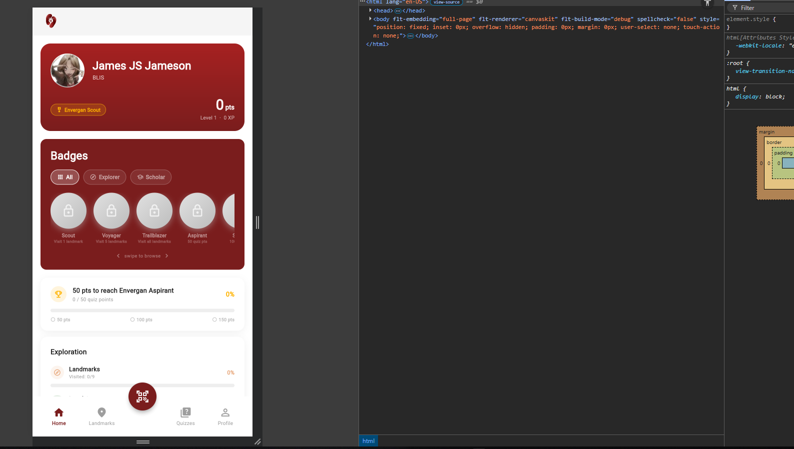
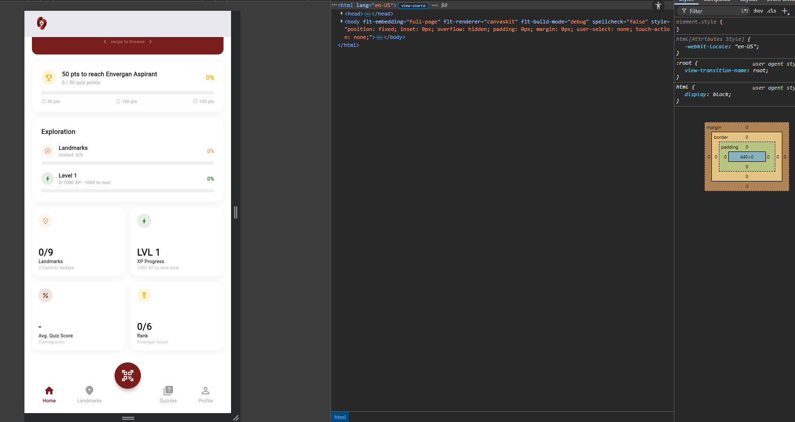
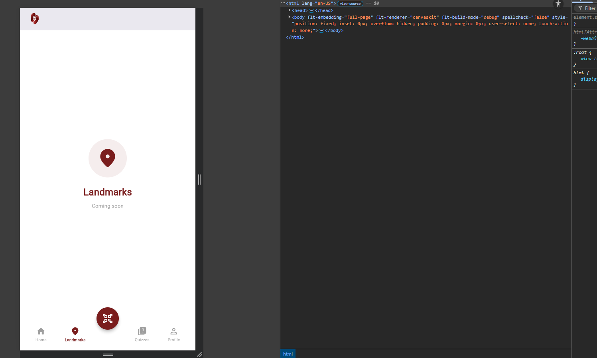
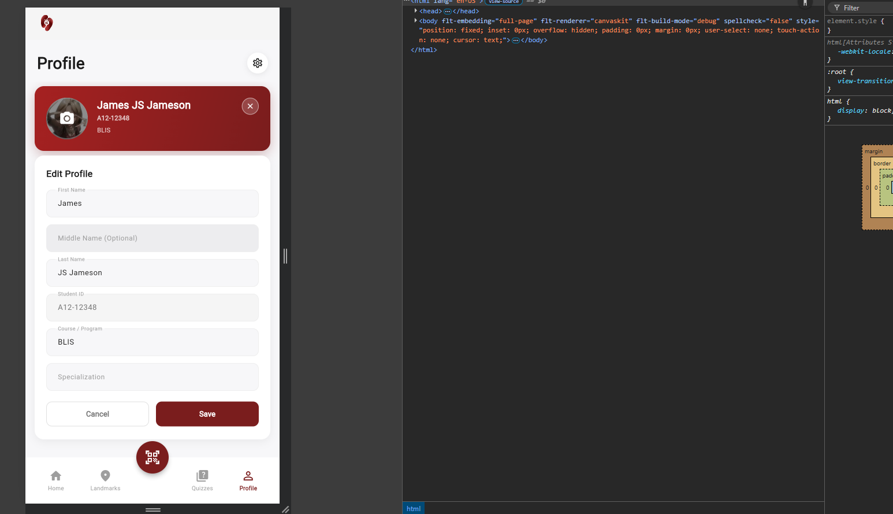

| Field         | Details                                                    |
| :------------ | :--------------------------------------------------------- |
| **Date**      | 2026-04-25                                                 |
| **Project**   | AdaVizion                                                  |
| **Topic**     | Frontend Architecture & Global UI Overhaul                 |
| **Developer** | Aguirre                                                    |
| **Tags**      | `Flutter`, `UI/UX`, `Refactoring`, `Architecture`, `Forms` |

# DEV LOG: WEEK 4 - DAY 7

## Core Objective

Resolve frontend technical debt by modularizing massive UI files into feature-based folders, implement a standardized bottom navigation system with a center-docked floating action button, and fortify user data integrity within the authentication and settings forms.

## 1. Architectural Refactoring (`lib/screens/`)

Eliminated "God Objects" to strictly separate UI layout from local widget state.

- **Dashboard Modularization:** Sliced the 1,700+ line `dashboard_screen.dart` into a feature-based directory (`dashboard/models`, `dashboard/views`, `dashboard/widgets`), reducing the main shell to ~120 lines.
- **Auth Modularization:** Refactored `login_screen.dart` into discrete view layouts (`auth_layout_view`, `success_layout_view`, `top_nav_bar`) and reusable component widgets to clean up the state machine.
- **State Isolation:** Pushed local UI state (like carousel scroll controllers and filter selections) strictly down to the child widgets that consume them (e.g., `BadgesCard`), keeping parent views stateless where possible.

## 2. UI/UX Implementations (`dashboard_screen.dart`, `home_view.dart`)

Overhauled the primary navigation and dashboard layout to align with modern app standards.

- **Center-Docked Navigation:** Replaced scattered routing buttons with a `BottomAppBar` featuring a `CircularNotchedRectangle` and a center-docked `FloatingActionButton` for the QR Scanner.
- **State Preservation:** Utilized an `IndexedStack` for main body routing so users retain their scroll positions when switching between Home, Landmarks, Quizzes, and Profile tabs.
- **Unified Hero Card:** Consolidated the user profile summary and point statistics into a single, compact, high-visibility Hero Card. Ensured crisp horizontal alignment by applying strict `EdgeInsets.symmetric(horizontal: 16.0)` margins and removing flexible vertical spacers.
- **Gizmo-Style Settings:** Replaced the legacy Progress tab with a dedicated "Profile" settings screen, migrating the "Edit Profile" and "Log Out" actions here to declutter the global application header.

## 3. Form & Data Integrity (`auth_layout_view.dart`, `settings_view.dart`)

Secured data inputs to prevent backend conflicts and maintain database validity.

- **Name Field Separation:** Replaced the monolithic "Full Name" input with explicit "First Name", "Middle Name (Optional)", and "Last Name" fields. The frontend now securely concatenates these values prior to payload submission.
- **Identifier Lock:** Applied `readOnly: true` to the Student ID text field within the Edit Profile form, preventing users from altering critical database identifiers while still allowing them to view their current ID.

## 4. Bug Fixes & Polish

- **Mascot Watermark Removal:** Stripped the background `logo.png` from the global stack to prevent interference with the new bottom navigation bar.
- **SnackBar Displacement Fix:** Assigned `behavior: SnackBarBehavior.floating` to all `ScaffoldMessenger` notifications. This ensures success and error banners float over the UI rather than pushing the center-docked QR scanner out of its notch.
- **Debug Ribbon:** Disabled the development banner via `debugShowCheckedModeBanner: false`.

