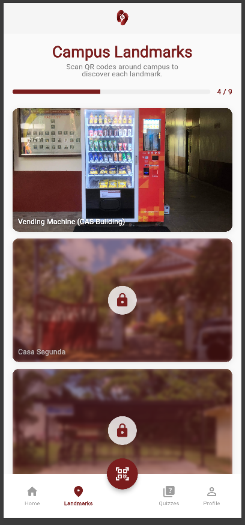
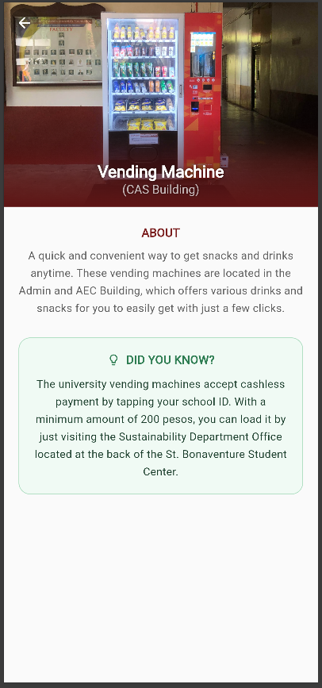

| Field | Details |
| :--- | :--- |
| **Date** | 2026-04-25 |
| **Project** | EUventure |
| **Topic** | Landmarks Module (Core Implementation, QR Routing & Style Fixes) |
| **Developer** | Dequito |
| **Tags** | `Flutter`, `Frontend`, `Landmarks`, `QR Code`, `Navigation`, `Bug Fixes`, `Dev Log` |

# DEV LOG: WEEK 4 - DAY 7

## Core Objective

Implement the full Campus Landmarks feature: a QR-code-gated checklist of campus landmarks with a progress header, locked/unlocked card states, a collapsing hero detail view, and a utility layer (models, constants, name parser, image fallback, error state).

## 1. API Refactor (`landmark_api.dart`)

Refactored `landmark_api.dart` to align with recent backend changes before building the UI on top of it. The two endpoints consumed by the feature are `GET /landmarks` (checklist) and `GET /landmarks/:id` (detail). The detail endpoint throws if the student has not yet scanned the landmark's QR code — the error message `"Scan landmark QR first"` is mapped to a friendly lock message in `LandmarkErrorState`.

## 2. Data Layer 

### Models (`landmark_model.dart`)

Two models cover the full data lifecycle.

`LandmarkSummary` is the lightweight checklist model. It carries only `landmark_id`, `name`, `img_path`, and `is_visited` — the minimum safe to display before a student scans a QR code. `LandmarkDetail` is the full model, adding `description` and `fun_fact`, and is only reachable after a successful QR scan.

Both are constructed via typed `fromJson` factories with explicit casts so bad server shapes surface immediately rather than silently producing nulls downstream.

### Constants (`landmark_constants.dart`)

All colors are defined as top-level `const` values rather than inline literals so the palette stays consistent across the card, detail view, error state, and fun-fact card. The set covers the primary maroon (`kLandmarkMaroon`), a darker hero-gradient variant (`kLandmarkMaroonDark`), and the full fun-fact green palette (`kFunFactGreen`, `kFunFactMint`, `kFunFactSage`, `kFunFactDeep`).

### Name Parser (`landmark_name_parser.dart`)

`parseLandmarkName` splits raw names like `"Vending Machine (CAS Building)"` into a tit`le and an optional subtit`le by scanning for parentheses. Returns a Dart record `({String title, String? subtitle})`. The hero sliver renders the subtitle in a smaller `white70` style below the main title when present, and omits it entirely when null.

## 3. Shared Widgets

### Image Fallback (`landmark_image_fallback.dart`)

`LandmarkImageFallback` is a `ColoredBox` with a centered `Icons.place_rounded` icon, used as the `errorBuilder` on every `Image.network` in the feature and as the default when imgPath is null or empty. `iconSize` is configurable — cards pass `40` (default), the detail hero passes `64`.

### Error State (`landmark_error_state.dart`)

`LandmarkErrorState` is a general-purpose error widget that accepts an optional `onRetry` for in-place reload (used in `LandmarkScreen`) and an optional `onBack` for screens that should pop on failure (used in `LandmarkDetailView`). Both can be supplied simultaneously. Raw error strings are never shown to the user — they're mapped internally to three friendly messages: a lock message for unscanned QR, a "no longer exists" message for 404s, and a generic connection error for everything else. The icon switches between `Icons.lock_rounded` and `Icons.wifi_off_rounded `based on the error type.

## 4. Landmark Card (`landmark_card.dart`)

`LandmarkCard` renders a `16:9` aspect-ratio card with a network image, a bottom name strip, and conditional locked styling.

* **Locked state:** `GestureDetector.onTap` is set to `null` for unvisited landmarks. `_CardImage` applies `ImageFilter.blur(sigmaX: 3, sigmaY: 3)` via `ImageFiltered` and overlays a 45%-opacity maroon tint. A centered `_LockBadge` (white circle + `Icons.lock_rounded`) renders on top.
* **Name strip:** Bottom-aligned `Text` with drop shadows for legibility against the image. Color dims to `white60` when locked.
* **Gradient removed:** The bottom gradient was stripped in a follow-up style commit in favor of the simpler text-shadow approach.

## 5. Landmark Screen (`landmark_screen.dart`)

Root screen for the feature. Fetches `LandmarkApi.getChecklist()`, maps the raw list to `List<LandmarkSummary>`, and renders a `CustomScrollView` with a progress header sliver and a `SliverList` of `LandmarkCards`. Pull-to-refresh is wired via `RefreshIndicator` → `_refresh()` which reassigns `_checklistFuture` and calls `setState`.

`_ProgressHeader` computes `visited / total` and feeds it into a `TweenAnimationBuilder<double>` driving a `LinearProgressIndicator` with a 900ms `easeOutCubic` curve. The visited count and total are displayed as `"N / M"` beside the bar.

Tapping a visited card calls `_openDetail`, which pushes `LandmarkDetailView` via `MaterialPageRoute`.

## 6. Landmark Detail View (`landmark_detail_view.dart`)
Full-screen detail pushed from `LandmarkScreen`. Fetches `LandmarkApi.getLandmark(landmarkId)` in initState and maps the response to `LandmarkDetail`.

* **Hero sliver:** `SliverAppBar` with `expandedHeight: 280` and `pinned: true`. The flexible space background stacks the network image (with fallback) under a four-stop maroon gradient (`transparent → 53% → 80% → 100%` from center to bottom). `parseLandmarkName` splits the name for the two-line title/subtitle overlay.

* **Back button:** A `CircleAvatar`-wrapped `IconButton` in the `leading` slot so it remains visible when the app bar is collapsed.
Description: Plain centered text with `height: 1.6` under an `"ABOUT"` section label.

* **Fun-fact card:** `_FunFactCard` — a mint-green rounded container with a sage border, a `Icons.lightbulb_outline icon`, and `"DID YOU KNOW?"` header in the deep-green palette.

## 7. Navigation & Routing Fixes
After the dashboard navigation refactor (from the Quiz module), routing to `LandmarkDetailView` and back broke due to changes in how `DashboardScreen` manages its navigation stack. These were corrected in a dedicated fix commit to ensure `Navigator.push / Navigator.pop` from the landmark flow works correctly within the `IndexedStack` shell without destroying the bottom nav.

---

## Screenshots

| Dialog | Screenshot |
| :--- | :--- |
| Landmarks List Screen |  |
| Landmarks Details Screen |  |
