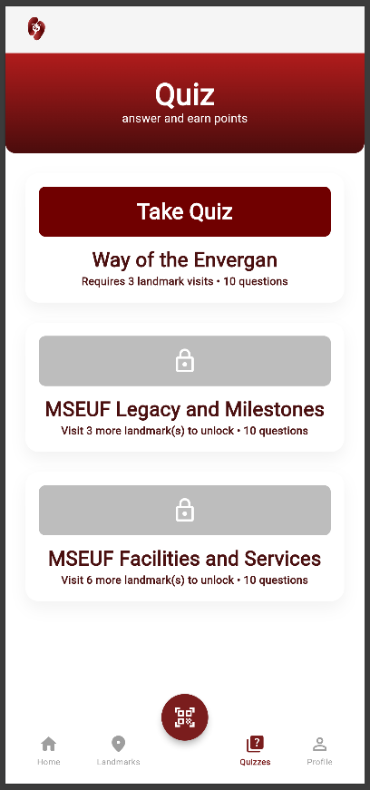
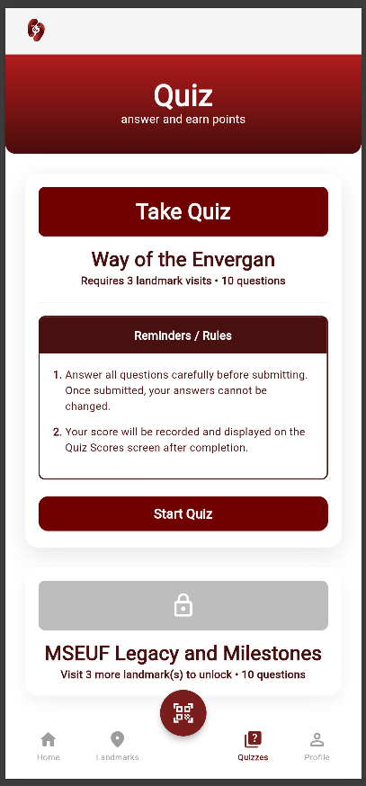
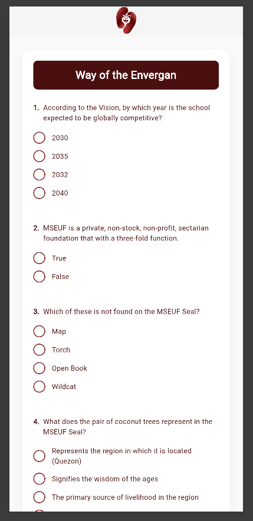
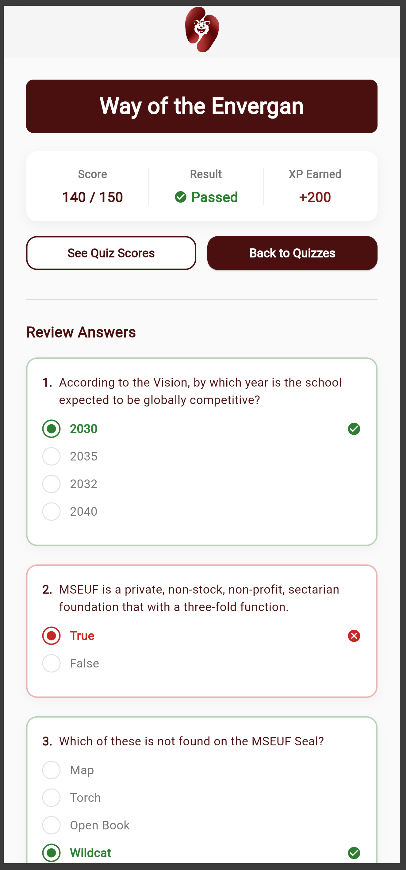

| Field | Details |
| :--- | :--- |
| **Date** | 2026-04-25 |
| **Project** | EUventure |
| **Topic** | Quiz Module (Core Implementation, Bug Fixes & Navigation Refactor) |
| **Developer** | Dequito |
| **Tags** | `Flutter`, `Frontend`, `Quiz`, `State Management`, `Navigation`, `Bug Fixes`, `Dev Log` |

# DEV LOG: WEEK 4 - DAY 7

## Core Objective

Implement the full quiz lifecycle from list → taking → results, including accordion-based quiz discovery, answer submission, graded result display with answer review, and correct navigation back to the dashboard shell.

## 1. Quiz List Screen (`quiz_list_screen.dart`)

Built an accordion-based quiz browser that fetches the quiz list and lazily loads per-quiz detail on expand.

- **Quiz states:** `QuizState` enum (`locked`, `unlocked`, `completed`) derived from backend `status` fields. Locked quizzes disable tap entirely. Completed quizzes show the achieved score in the header pill instead of "Take Quiz".
- **Accordion pattern:** `_expandedQuizId` tracks the single open card. Tapping a card triggers `_loadDetail(quizId)` which fetches `GET /quizzes/:id` and caches the result in `_detailData`. Re-tapping collapses. Only one card is expanded at a time.
- **Detail caching:** `_detailData`, `_detailLoading`, and `_detailErrors` are keyed by `quiz_id`. Already-fetched detail is not re-fetched on re-expand unless explicitly invalidated.
- **Cache invalidation on return:** After `QuizTakingScreen` resolves (quiz submitted and user navigated back), the detail cache entry for that quiz is removed and `_loadQuizzes()` is called to refresh the list. The accordion is also collapsed so the user doesn't see stale data during the reload.
- **`onNavigateToTab` callback:** Threaded down from `DashboardScreen` so the result screen can switch the shell's active tab without breaking the navigation stack.

## 2. Quiz Taking Screen (`quiz_taking_screen.dart`)

Renders all questions for a quiz and handles answer collection and submission.

- **Question ordering:** Questions are sorted ascending by `question_id` before rendering, guaranteeing consistent display order regardless of server response or cache insertion order.
- **Answer state:** `_selectedAnswers` maps `question_id → selected choice index (0-based)`. Rendered as custom radio circles — filled dot when selected, empty when not.
- **Submit guard:** `_allAnswered` checks that every `question_id` in the sorted list has a corresponding entry in `_selectedAnswers`. Submit is blocked and an error message shown if any question is unanswered.
- **Payload:** `_buildAnswersPayload()` maps `_selectedAnswers` to the `{ question_id, selected_idx }` shape expected by `POST /quizzes/:id/submit`.
- **Navigation:** On successful submit, `Navigator.pushReplacement` to `QuizResultScreen`, passing `_questions` (sorted), `_selectedAnswers`, and `onNavigateToTab` so the result screen has everything it needs without re-fetching.

## 3. Quiz Result Screen (`quiz_result_screen.dart`)

Displays the graded result and a full per-question answer review.

- **Stats row:** Score (`score_achieved / max_score`), Pass/Fail with icon, and XP earned — pulled from `result['quiz']['performance']` and `result['progress']['xp']`.
- **Answer review:** Driven by the `questions` list and `selectedAnswers` map passed from `QuizTakingScreen` — not re-derived from the breakdown. The breakdown is used only to build a `correctnessById` lookup (`question_id → is_correct`) via `result['quiz']['breakdown'][*]['performance']['is_correct']`.
- **Review card behavior:** Each question card shows all choices. The user's selected choice is highlighted green (correct) or red (wrong). All other choices remain plain grey with an empty circle — the correct answer is never revealed unless the user happened to pick it.
- **Card border:** Green border for correct answers, red for incorrect. A matching icon appears in the question row header.
- **Reward toasts:** Level-up and achievement snackbars shown via `addPostFrameCallback`. Marked TODO for replacement with a dedicated notification system.
- **Navigation buttons:**
  - *See Quiz Scores* → calls `onNavigateToTab(0)` then `popUntil(isFirst)` to land on Home tab.
  - *Back to Quizzes* → calls `onNavigateToTab(2)` then `popUntil(isFirst)` to land on Quizzes tab.

## 4. Navigation Architecture Fix

The quiz flow is launched via `Navigator.push` from `QuizListScreen` (inside `DashboardScreen`'s `IndexedStack`). The result screen previously used `pushAndRemoveUntil` with bare screen constructors, destroying `DashboardScreen` and losing the bottom nav shell entirely.

- **Fix:** All return navigation now uses `popUntil(route => route.isFirst)`, which unwinds back to `DashboardScreen` with the shell intact.
- **Tab targeting:** `onNavigateToTab` callback is passed from `DashboardScreen` → `QuizListScreen` → `QuizTakingScreen` → `QuizResultScreen`. When a result button is tapped, the callback fires first to update `_selectedIndex` in `DashboardScreen`, then `popUntil` unwinds — so the shell is already on the correct tab when it reappears.

---

## 5. Known Issues & To-Dos

| # | Issue | Priority |
| :--- | :--- | :--- |
| 1 | Question sort by `question_id` is a defensive workaround for inconsistent ordering from the detail cache. Root cause not fully identified — sort stays in as a guard. | Low |
| 2 | Reward toasts (level-up, achievements) use `SnackBar` as a temporary implementation. Needs replacement with a proper notification/toast system. | Medium |
| 3 | `selected_idx` not included in submit response breakdown — correctness is derived from `is_correct` flag; selected answer display relies on client-side `selectedAnswers` map passed through navigation. Cleaner if backend includes `selected_idx` in breakdown `performance`. | Low |

---

## Screenshots

| Dialog | Screenshot |
| :--- | :--- |
| Quiz List Screen |  |
| Quiz List Screen - Expanded |  |
| Quiz Taking Screen |  |
| Something Went Wrong |  |
| Quiz Results Screen |  |