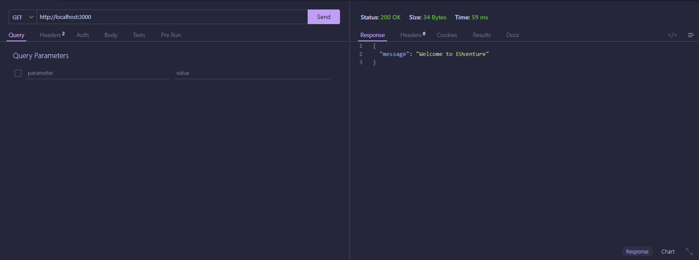
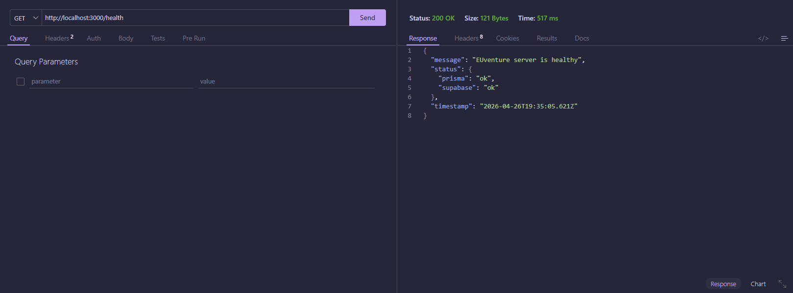

| Field | Details |
| :--- | :--- |
| **Date** | 2026-04-27 |
| **Project** | EUventure |
| **Topic** | Health Monitoring & Root Endpoint Refactoring |
| **Developer** | Tagle |
| **Tags** | `Prisma`, `Supabase`, `Render`, `DevOps`, `Refactoring`, `RCSR-Architecture` |

# DEV LOG: WEEK 5 - DAY 2

## Core Objective

Implement a robust health monitoring system to ensure backend reliability on Render and refactor the root endpoint to strictly adhere to the backend's RCSR (Route-Controller-Service-Repository) architectural pattern.

## 1. Infrastructure Monitoring & Health Checks

Developed a diagnostic system to monitor critical external dependencies.

   * **Parallel Validation:** Implemented `Promise.all` logic in the controller layer to orchestrate simultaneous status pings to PostgreSQL and Supabase, minimizing latency.

   * **Dependency Verification:** Created dedicated service-level checks to verify that both the database client and cloud storage bucket are not just reachable, but operational.

   * **Diagnostic Payload:** Configured the `/health` response to return a detailed JSON object including a status breakdown, ISO timestamp, and server message.

## 2. RCSR Architectural Refactoring

Standardized the entry point of the API to align with the modular design used in student and landmark modules.

   * **Controller Extraction:** Decoupled the root route logic from `index.ts` and migrated it to a new `server.controller.ts`.

   * **Service-Oriented Logic:** Encapsulated health check logic within `server.service.ts` to keep controllers lean and focused on request/response orchestration.

   * **Repository Expansion:** Updated `landmarks.repository.ts` with lightweight query methods (`findOneLandmark`, `findOneLandmarkThumbnail`) specifically designed for low-overhead connectivity testing.

## 3. Deployment Optimization & "Keep-Alive" Strategy

Addressed infrastructure constraints associated with the Render free-tier deployment.

   * **Spin-down Mitigation:** The `/health` endpoint is strategically designed for integration with external cronjobs. This prevents the server from entering an idle state, ensuring zero-latency responsiveness during project presentations and demos.

   * **Proactive Diagnostics:** Provides immediate feedback on infrastructure failures, allowing for faster troubleshooting before client-side errors propagate to the Flutter mobile app.

## 4. Enhanced Error Mapping

Refined the central error handling logic to provide descriptive, actionable feedback for infrastructure-level exceptions.

   * **Standardized Server Errors:** Integrated `PRISMA_UNHEALTHY` and `SUPABASE_UNHEALTHY` codes into `error-maps.ts`.

   * **System-Level Feedback:** Ensured that connectivity failures return standardized error objects, maintaining consistency across the entire API ecosystem.

## Tested Endpoints

| Endpoint | Method | Description | Screenshot |
| :--- | :--- | :--- | :--- |
| `/` | `GET` | Returns the root welcome message via the refactored home controller. |  |
| `/health` | `GET` | Returns full system status including Prisma and Supabase connectivity states. |  |